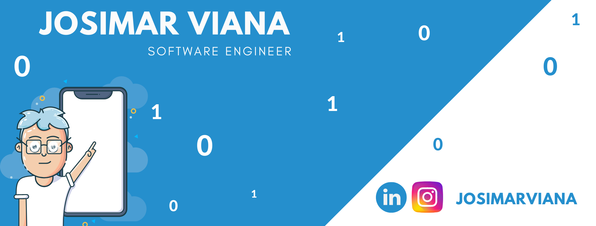

<table>
    <tr>
        <td></td>
        <td></td>
    </tr>   
</table>

  
### Hi there 👋

Sou Engenheiro de Software, atuo na área desde 2015 (e desde 1997 estudando informática 😱) e sou mestre em Computação Aplicada.
<a href="https://www.linkedin.com/in/josimarviana"></img></a> [LinkedIn](https://www.linkedin.com/in/josimarviana)  
![](https://komarev.com/ghpvc/?username=josimarviana&color=blue&style=flat
